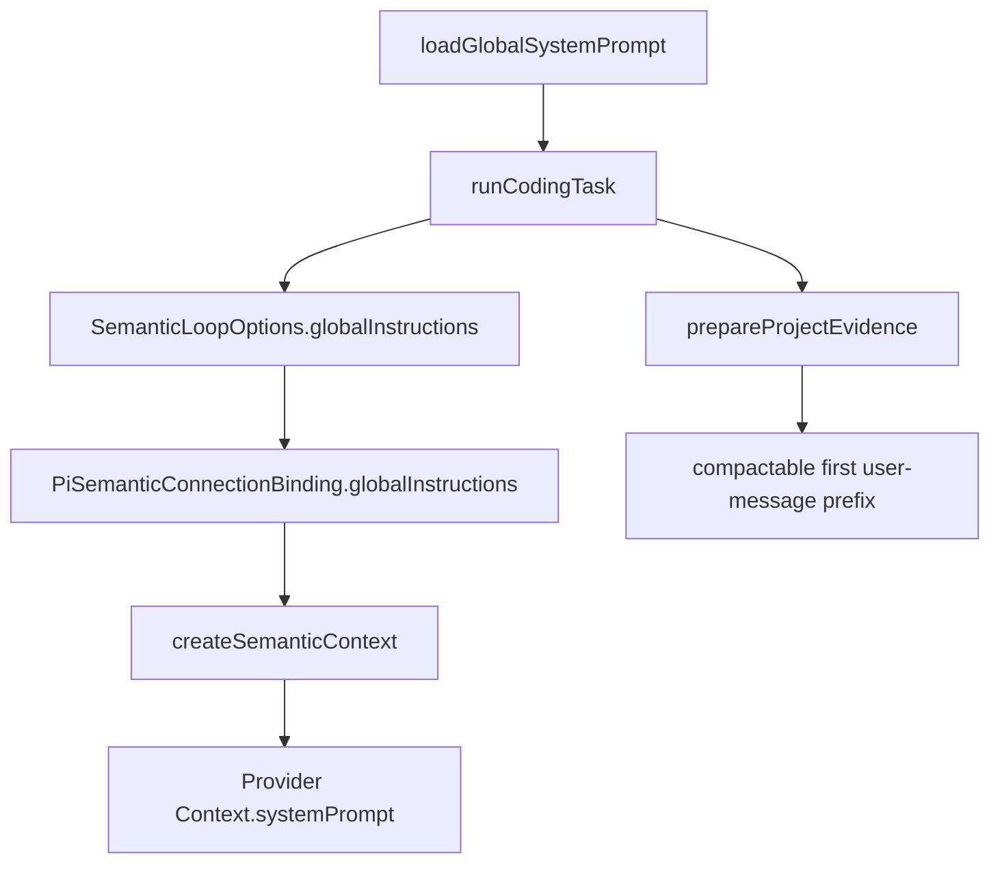
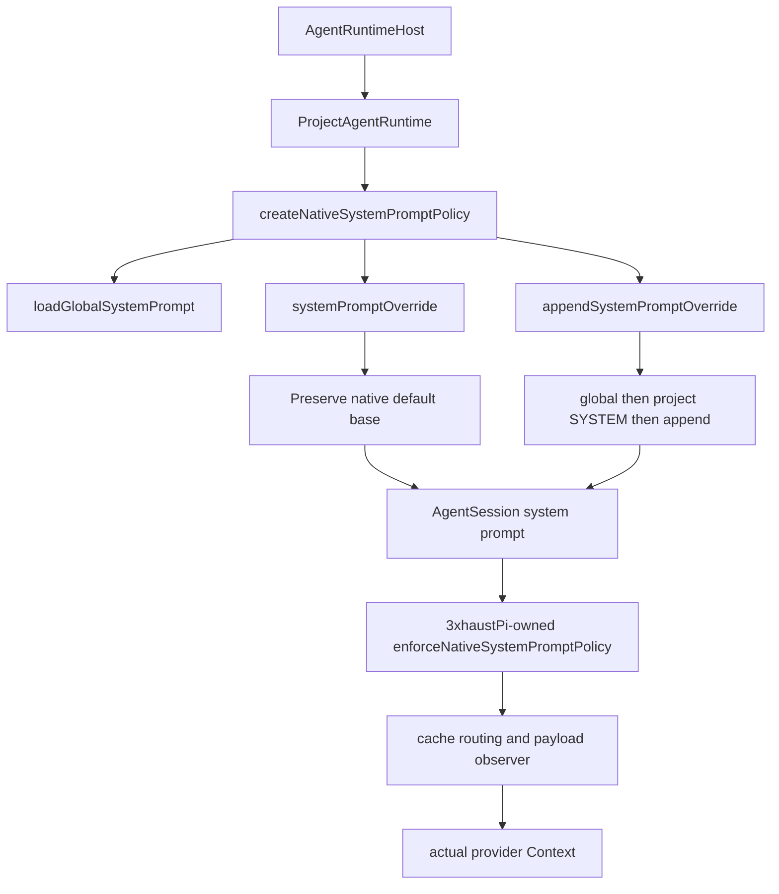

# 3xhaustPi 전역 시스템 프롬프트와 릴리즈 거버넌스 설계

작성일: 2026-08-28
대상: 3xhaustPi maintainers
상태: 구현 기준 문서

## 1. 결론

3xhaustPi는 사용자 전역 지침을 다음 하나의 파일에서 읽어야 한다.

```text
~/.3xhaust/system-prompt.md
```

이 파일은 모든 프로젝트에서 공유하지만, 3xhaustPi의 불변 protocol이나 tool
권한을 대체하는 보안 설정은 아니다. 사용자 전역 지침은 provider의 실제
system/developer instruction slot에 전달하고, repository 파일·tool output·검색
결과와 같은 낮은 신뢰도의 자료는 별도의 context로 유지해야 한다.

반복적인 릴리즈 절차는 전역 프롬프트에 장문으로 넣지 않는다. 기존
`npm-release` built-in skill은 로컬 `npm login`과 `npm publish`를 지시하므로
삭제하고, 짧은 `release-governance` 절차로 교체한다. 다만 현재 semantic
fallback의 3xhaustPi 전용 skill loader는 우선순위 결정 후 남은 모든 body를
eager injection한다. 따라서 이번 변경은 Agent Skills progressive-disclosure
호환을 주장하지 않는다. 정확한 표현은 “bounded SKILL.md-shaped instruction
resources”이다.

핵심 설계는 다음과 같다.

1. 전역 파일은 정확한 user data root에서만 읽는다.
2. 파일은 16,384 raw bytes로 제한하고 strict UTF-8, regular file, no symlink,
   no NUL을 요구한다.
3. semantic fallback에서는 전역 지침을 `stableContext`가 아닌 별도의 provider
   system slot에 전달한다.
4. native CLI/TUI에서는 coding-agent의 기존 resource override hook을 사용하고,
   3xhaustPi provider wrapper에 새로운 최종 system prompt policy guard를
   추가한다.
5. project `.pi/SYSTEM.md`와 project context는 전역 지침을 삭제하거나 교체할 수
   없다.
6. prompt/resource digest를 provider cache identity와 semantic checkpoint에
   반영한다.
7. npmjs 배포에서는 지원되고 설정된 Trusted Publishing을 반드시 사용한다.
   지원되지 않는 registry·CI라면 임의의 token/local publish로 대체하지 않고
   사용자 승인을 다시 받는다.
8. hosted repository의 default branch는 PR flow로 보호하고, CI가 merge gate인지
   workflow 파일 존재가 아니라 active required-check rule로 검증한다.

## 2. 조사 방법과 증거 수준

조사는 prompt provider, coding harness, prompt-injection security, Agent Skills,
npm, GitHub governance, CI, 3xhaustPi architecture의 여덟 축으로 나누었다.
본문은 최종 결정에 직접 쓰인 source와 current repository observation만
인용한다. Primary source와 서로 독립적인 구현·보안 문서를 우선한다.

증거의 우선순위는 다음과 같다.

1. 현재 repository source와 live GitHub/npm API 관찰
2. provider·registry·hosting platform의 primary documentation
3. 개방형 specification과 독립 security standard
4. peer-reviewed security 연구
5. 설계 종합과 trade-off 판단

자연어 prompt는 probabilistic behavior를 유도하므로 문장 자체를 test하지
않는다. 구현 test는 file boundary, provider `Context.systemPrompt`, ordering,
digest, cache namespace, resume phase와 packaged skill identity처럼
machine-consumed contract를 검증한다.

## 3. Provider instruction hierarchy에서 일반화할 수 있는 것

OpenAI는 Root > System > Developer > User의 명시적 chain of command를
문서화한다. 같은 authority의 지침이 충돌하면 일반적으로 뒤의 지침이
우선하지만, 충돌하지 않는 앞선 지침까지 모두 삭제된다는 뜻은 아니다.
Model Spec은 production model이 specification을 완전히 반영하지 않을 수
있다고 함께 경고한다
([OpenAI Model Spec](https://model-spec.openai.com/2025-12-18.html#chain_of_command),
[OpenAI prompt engineering](https://platform.openai.com/docs/guides/prompt-engineering#message-roles-and-instruction-following)).

Anthropic Messages API는 top-level `system` field를 제공하지만 OpenAI와 동일한
충돌 해결 hierarchy를 명시하지 않는다. Google도 system instructions가 request
전체에 적용된다고 설명하지만 “항상 user보다 우선한다”는 portable contract를
제공하지 않는다
([Anthropic Messages API](https://platform.claude.com/docs/en/api/messages#body-parameters),
[Google system instructions](https://docs.cloud.google.com/gemini-enterprise-agent-platform/models/prompts/system-instructions#use-cases)).

따라서 3xhaustPi는 다음만 보장한다.

- host가 정한 slot과 serialization order는 결정적이다.
- provider별 adapter가 지원하는 실제 system/developer field를 사용한다.
- host protocol, typed parser, capability validation이 최종 enforcement를 담당한다.
- model이 자연어 충돌을 언제나 동일하게 해결한다고 보장하지 않는다.

정확한 output determinism도 주장하지 않는다. Gemini의 temperature 0은 mostly
deterministic일 뿐이며 Cohere seed도 best effort이다. GitHub Copilot 역시
custom instructions를 매번 동일하게 따르지 않을 수 있다고 밝힌다
([Google system instructions](https://docs.cloud.google.com/gemini-enterprise-agent-platform/models/prompts/system-instructions#use-cases),
[Cohere Chat API](https://docs.cohere.com/v2/reference/chat#request),
[Copilot customization](https://docs.github.com/en/copilot/concepts/prompting/response-customization?tool=webui#precedence-of-custom-instructions)).

## 4. Stable prefix와 prompt cache

OpenAI와 Anthropic은 반복되는 static content를 prompt 앞부분에 두는 구조를
직접 권장한다. Google과 AWS도 반복 context의 cache reuse를 제공하지만, cache
eligibility와 명시적 cache resource 구조는 서비스마다 다르다
([OpenAI prompt caching](https://platform.openai.com/docs/guides/prompt-caching#best-practices),
[Anthropic prompt caching](https://platform.claude.com/docs/en/build-with-claude/prompt-caching#structuring-your-prompt),
[Google context caching](https://docs.cloud.google.com/vertex-ai/generative-ai/docs/context-cache/context-cache-overview#implicit-caching),
[AWS prompt caching](https://docs.aws.amazon.com/bedrock/latest/userguide/prompt-caching.html#prompt-caching-how-it-works)).

3xhaustPi 전역 지침은 프로젝트마다 동일하므로 provider system prefix에 두는 것이
cache reuse에도 적합하다. 다만 파일 한 byte가 바뀌면 그 지점 이후의 cache가
의도적으로 invalidation된다. “전역 파일을 추가해도 cache hit가 항상 유지된다”는
주장은 하지 않는다. 올바른 정책은 다음과 같다.

- 동일한 prompt bytes와 model/account/project 조합은 동일 cache affinity를 쓴다.
- 전역 prompt, project SYSTEM, skill, tool guideline처럼 실제 provider prefix를
  바꾸는 입력은 cache identity를 바꾼다.
- prompt edit 이후의 cache miss는 stale policy reuse를 막는 올바른 결과다.
- cache는 performance optimization이지 authority나 deletion guarantee가 아니다.

OpenAI는 production prompt를 application code에서 version·review·test하라고
권장하고 hosted reusable prompt objects를 폐기 중이다
([OpenAI version prompts in code](https://platform.openai.com/docs/guides/prompt-engineering#version-prompts-in-code),
[OpenAI deprecations](https://developers.openai.com/api/docs/deprecations#2026-06-03-reusable-prompts)).
사용자가 편집하는 전역 파일도 같은 원칙을 따라 bounded parser, digest,
provider-capture test를 가진다.

## 5. Coding harness의 global/project instruction semantics

Coding harness는 provider API와 별도의 file discovery policy를 가진다.

- Codex는 global `AGENTS.md` 다음 project root에서 CWD까지 파일을 결합하고,
  가까운 지침을 뒤에 둔다
  ([Codex AGENTS.md](https://developers.openai.com/codex/guides/agents-md/)).
- Claude Code는 broad-to-specific context를 결합하지만 conflict가 있으면 임의의
  한쪽을 따를 수 있다고 경고한다. 확실한 enforcement에는 hook/settings를
  사용한다
  ([Claude Code memory](https://code.claude.com/docs/en/memory#how-claude-md-files-load),
  [Claude hooks](https://code.claude.com/docs/en/hooks-guide)).
- Gemini CLI는 global, workspace, local context를 결합하지만 동일한 winner
  semantics를 portable contract로 제시하지 않는다
  ([Gemini CLI GEMINI.md](https://geminicli.com/docs/cli/gemini-md/#understand-the-context-hierarchy)).
- Copilot의 personal > repository > organization 순서는 Copilot product의
  정책이지 OpenAI API authority rule이 아니다
  ([Copilot precedence](https://docs.github.com/en/copilot/concepts/prompting/response-customization?tool=webui#precedence-of-custom-instructions)).

3xhaustPi는 이 차이를 숨기지 않고 product-level policy를 명시한다.

```text
host semantic/tool/approval contract
  > user-global 3xhaustPi behavioral instructions
  > selected project SYSTEM/APPEND/AGENTS context
  > repository/tool/retrieved data
```

여기서 `>`는 host가 구성하는 intended authority와 placement를 뜻한다. 모델의
완전한 순응이나 sandbox isolation을 뜻하지 않는다.

## 6. Prompt injection과 trust boundary

OWASP는 indirect prompt injection이 website, file, tool output 같은 외부
자료에서 발생한다고 설명하며 least privilege, input/output validation,
segregation, monitoring, human approval을 함께 요구한다
([OWASP LLM01](https://genai.owasp.org/llmrisk/llm01-prompt-injection/#how-to-prevent),
[OWASP cheat sheet](https://cheatsheetseries.owasp.org/cheatsheets/LLM_Prompt_Injection_Prevention_Cheat_Sheet.html)).

XML tag나 marker는 provenance를 명확히 하고 accidental confusion을 줄일 수
있지만 security boundary가 아니다. Anthropic도 XML을 structure guidance로
권장할 뿐 isolation guarantee로 설명하지 않는다
([Anthropic prompting](https://platform.claude.com/docs/en/build-with-claude/prompt-engineering/claude-prompting-best-practices#structure-prompts-with-xml-tags)).
연구에서도 stock model의 instruction/data separation은 불완전하며, StruQ 같은
방법은 secure frontend뿐 아니라 특별히 훈련된 model을 요구한다
([Zverev et al.](https://arxiv.org/abs/2403.06833),
[StruQ](https://arxiv.org/abs/2402.06363)).

따라서 전역 prompt에는 secret을 넣지 않는다. 또한 다음 동작은 prompt가 아니라
host code에서 계속 제한한다.

- project root 밖의 파일 변경
- credential과 account 사용
- network destination
- 외부 publish/deploy/write
- destructive operation
- patch approval과 stale-source 검증
- structured semantic output parsing

OpenAI도 untrusted data를 developer message에 넣지 말라고 권고하고, mitigation
이 있어도 agent가 속을 수 있다고 밝힌다
([OpenAI agent safety](https://platform.openai.com/docs/guides/agent-builder-safety#dont-use-untrusted-variables-in-developer-messages)).

## 7. 전역 파일 contract

### 7.1 위치와 scope

production path는 `resolveUserDataDirectory()`가 반환하는 active user root의
정확한 `system-prompt.md`다. 기본 위치는 다음과 같다.

```text
~/.3xhaust/system-prompt.md
```

project root의 `.3xhaust/system-prompt.md`, `SYSTEM.md`, 이름이 비슷한 파일은
이 기능의 입력으로 검색하지 않는다. Project-native `.pi/SYSTEM.md`는 별도의
낮은 우선순위 context로 남는다.

### 7.2 parser

| 입력 | 결과 |
|---|---|
| 파일 없음 | 전역 overlay 없음, 기존 byte-compatible 동작 |
| whitespace-only | missing file과 같은 logical absence |
| 1–16,384 raw bytes | strict UTF-8 decode 후 사용 |
| 16,385 bytes 이상 | typed actionable error |
| invalid UTF-8 | typed actionable error |
| NUL 포함 | typed actionable error |
| symlink | 거부 |
| directory/FIFO/device/socket | 거부 |
| read/permission failure | typed actionable error |

16 KiB는 약 4K tokens 수준의 always-on overhead 상한을 두기 위한 product
decision이다. token 수는 tokenizer와 언어에 따라 달라지므로 exact token
guarantee로 표현하지 않는다. 길이는 JavaScript character가 아닌 raw bytes로
판정하고 truncation하지 않는다.

Whitespace-only 파일은 global prompt digest component를 만들지 않는다.
SHA-256은 nonblank accepted file의 raw bytes에서만 계산한다. Line endings를
임의로 바꾸지 않는다. 같은 bytes는 같은 digest와 cache identity를 만든다.

### 7.3 filesystem residual risk

현재 Node/platform seam에서 regular file와 symlink 검증을 수행하지만 완전한
dirfd-based parent walk와 same-UID malware/plugin 방어를 주장하지 않는다.
`stat` 후 `read` 사이의 race는 일반적인 TOCTOU 위험이다
([CWE-363](https://cwe.mitre.org/data/definitions/363.html)).
strict UTF-8은 malformed sequence의 security ambiguity를 피한다
([RFC 3629 §10](https://www.rfc-editor.org/rfc/rfc3629#section-10)).
Node의 일반 `"utf8"` 문자열 읽기는 malformed byte를 replacement character로
바꿀 수 있으므로 strict decode에는
`TextDecoder("utf-8", { fatal: true })` 또는 동등한 byte-level validator를
사용한다.

전역 prompt는 같은 OS user가 수정할 수 있는 preference/policy input이다.
따라서 “owner file이므로 공격 불가능”이나 “system prompt라서 secret”이라는
주장을 하지 않는다.

## 8. 3xhaustPi architecture

### 8.1 공통 loader

`packages/3xhaustpi/src/resource-loader-system-prompt.ts`가 parsing을 단독
소유한다. semantic runtime과 native runtime 모두 이 함수를 사용한다. parser를
두 벌 만들지 않는다.

`HarnessResources`는 다음 정보를 가진다.

```ts
interface GlobalSystemPromptResource {
  readonly instructions: string;
  readonly sourcePath: string;
  readonly sha256: string;
}
```

prompt와 resolved winning skills로 `resourceContextDigest`를 만들고 hooks는
제외한다. Hook metadata는 provider context가 아니므로 prompt cache identity에
들어가면 안 된다.

### 8.2 Semantic fallback

현재 `runCodingTask()`는 resource context를 `prepareProjectEvidence()`에 넣고,
pi-adapter는 18,000자를 넘는 `stableContext`의 tail을 보존한다
(`packages/3xhaustpi/src/coding-runtime-project.ts`,
`packages/pi-adapter/src/compaction.ts`). 전역 지침을 여기에 prepend하면
overflow 시 삭제되고, adapter가 “inert project evidence”라고 label한다.

따라서 별도 typed field를 사용한다.



Provider system text의 순서는 다음과 같다.

1. immutable 3xhaustPi semantic boundary
2. 전역 지침이 host protocol/tool authorization을 약화할 수 없다는 설명
3. 정확한 user-global content

Project snapshot과 eager skill bodies는 첫 user message의 bounded evidence에
남는다. Initial request와 repair request가 같은 system prompt를 사용하는지
faux provider `Context`로 검증한다.

### 8.3 Native CLI/TUI

일반 CLI/TUI 요청은 semantic fallback보다 먼저 `AgentRuntimeHost`와
coding-agent `AgentSession`을 사용한다. 이 경로를 빠뜨리면 “모든 프로젝트와
세션” 요구를 충족하지 못한다.

Generic coding-agent production code를 바꾸지 않고 기존 resource hook을
조합한다.



전역 파일이 있을 때:

1. `systemPromptOverride`는 발견된 project `.pi/SYSTEM.md`를 capture하고
   `undefined`를 반환해 native default base를 유지한다.
2. `appendSystemPromptOverride`는 global, captured project SYSTEM, 기존
   APPEND_SYSTEM 순으로 반환한다.
3. AGENTS/project context와 native skills는 coding-agent의 기존 renderer가
   뒤에 추가한다.
4. 현재 provider wrapper는 system prompt를 검증하거나 복구하지 않는다.
   따라서 3xhaustPi 소유의 native provider wrapper에 새
   `enforceNativeSystemPromptPolicy(context)` 단계를 추가한다. Provider 호출
   직전에 현재 session policy snapshot의 required base가 없거나 교체되었으면
   정확히 한 번 복구한다.
5. 기존 cache routing과 payload observer는 복구된 context를 받고, wrapper
   재설치·cache warm·compaction에서도 global section을 중복 적용하지 않는다.

전역 파일이 없으면 두 override는 기존 값을 그대로 반환해 현재
`.pi/SYSTEM.md` replacement behavior를 보존한다.

### 8.4 Lifecycle

| lifecycle | 동작 |
|---|---|
| initial CLI/TUI session | service resource reload에서 전역 파일 읽기 |
| fresh/new session | 현재 파일 다시 로드 |
| persisted-session resume | 현재 파일 다시 로드 |
| delegated child | 격리된 runtime에서 같은 parser 사용 |
| model switch in live session | 동일 session policy snapshot 유지 |
| explicit resource reload | current file로 갱신 |
| mid-stream edit | 실행 중 request는 변경하지 않음 |
| cache warm | 현재 full native system prompt 사용 |
| side question | 같은 native policy factory 사용 |
| compaction | summarization contract 뒤에 global compatibility section만 추가 |

파일을 매 turn 읽지 않는다. Mid-stream prefix 변경과 file race를 피하고 session
단위로 일관된 behavior를 유지하기 위해서다.

### 8.5 Cache와 resume

현재 native cache affinity는 project, provider, model, account만 포함한다.
목표 구현에서는 완성된 `session.systemPrompt`의 SHA-256 digest를 추가한다.
그러면 전역 prompt, project SYSTEM, APPEND_SYSTEM, context file, resolved native
skill, tool guideline처럼 native system prompt를 바꾸는 입력이 새 affinity를
만든다.

Semantic checkpoint에는 optional `resourceContextDigest`를 추가한다.

- legacy checkpoint에 필드가 없으면 읽을 수 있다.
- `provider-ready`는 아직 model output이 없으므로 current policy로 시작한다.
- `provider-settled` 또는 follow-up phase에서 digest가 바뀌면 stale continuation을
  막는다.
- `patch-approved`와 `patch-applied`는 추가 model reasoning 없이 host가 승인된
  patch를 처리하므로 그대로 진행한다.

이 선택은 이전 모델 출력과 새 policy를 한 추론 연속성에서 섞지 않는다.
Prompt edit 이후 현재 policy를 적용하고 싶으면 새 semantic operation을 시작한다.

## 9. System prompt와 skill의 역할 분리

Primary harness documentation은 persistent context와 on-demand procedure를
구분한다. Claude는 매 session 필요한 build command·convention·layout은
CLAUDE.md에, 좁은 multi-step workflow는 skill에 두라고 권한다
([Claude memory placement](https://code.claude.com/docs/en/memory#when-to-add-to-claudemd)).
Gemini도 GEMINI.md를 항상 제공하는 context, skill을 on-demand expertise로
설명한다
([Gemini context](https://geminicli.com/docs/cli/gemini-md#understand-the-context-hierarchy),
[Gemini skills](https://geminicli.com/docs/cli/skills/)).

따라서 전역 prompt에는 짧은 invariant만 둔다.

- 구현 전 architecture와 affected boundary를 확인한다.
- smallest correct maintainable change를 선호한다.
- speculative abstraction, broad cleanup, unnecessary compatibility layer를 피한다.
- hosted repository에서는 work-unit branch와 protected-default-branch PR flow를
  사용한다.
- CI는 risk에 비례하고, 실패를 우회하거나 test를 약화하지 않는다.
- npmjs에서 Trusted Publishing이 지원·설정된 경우 local publish와 long-lived
  write token을 사용하지 않는다.
- 정확한 command와 exception은 repository instructions와 skill을 따른다.

Skill은 npm/GitHub release 작업에서 필요한 checklist와 절차를 담는다.

## 10. Agent Skills 조사와 현재 3xhaustPi 제한

Agent Skills specification은 `SKILL.md` directory, mandatory `name`과
`description`, folder/name match, progressive disclosure를 정의한다
([Agent Skills specification](https://agentskills.io/specification),
[integration guide](https://agentskills.io/integrate-skills)).

권장 lifecycle은 다음과 같다.

1. startup: name + description catalog
2. activation: selected SKILL.md body
3. execution: referenced resource on demand

OpenAI Codex, Claude Code, VS Code/Copilot, Gemini CLI, OpenCode도 metadata-first
loading을 구현한다
([Codex skills](https://developers.openai.com/codex/skills/),
[Claude skills](https://code.claude.com/docs/en/skills),
[VS Code skills](https://code.visualstudio.com/docs/copilot/customization/agent-skills),
[Gemini CLI skills](https://geminicli.com/docs/cli/skills/),
[OpenCode skills](https://opencode.ai/docs/skills/)).

현재 3xhaustPi에는 서로 다른 두 skill 경로가 있다. Native CLI/TUI가 사용하는
coding-agent 경로는 skill metadata를 system prompt에 싣고 선택된 `SKILL.md`를
read tool로 읽는 metadata-first 방식을 이미 제공한다. 반면 semantic fallback의
3xhaustPi 전용 loader는 우선순위 결정 후 남은 skill body를 모두 project
evidence에 eager injection한다. 아래 제한은 semantic fallback loader에만
적용한다.

- directory ID가 semantic loader의 collision key다.
- semantic loader의 flat `key: value` parser는 완전한 YAML parser가 아니다.
- semantic loader는 우선순위 결정 후 남은 body를 모두 eager injection한다.
- semantic skill context는 8 KiB aggregate cap을 넘는 첫 block부터 나머지를
  생략한다.
- semantic loader에는 project skill trust gate가 없다.
- semantic loader에는 `.agents/skills` discovery와 referenced resource
  activation이 없다.

Native 경로와 semantic 경로 모두 Agent Skills specification 전체 호환을
주장하지 않는다. 이번 변경은 두 경로의 차이를 유지하되,
`release-governance`의 folder와 frontmatter name을 일치시키고 UTF-8 기준
4,096 bytes 이하의 advisory body로 유지한다. Token 수는 참고값으로만
기록한다. 향후 별도 work unit에서 typed read-only
`activateSkill({ id }) -> { id, scope, sha256, instructions }`를 도입하는 것이
최소한의 progressive-disclosure seam이다.

## 11. Release governance

### 11.1 Trusted Publishing의 정확한 역할

npm Trusted Publishing은 GitHub Actions OIDC identity를 short-lived publishing
credential로 교환해 long-lived npm write token을 제거한다
([npm Trusted Publishers](https://docs.npmjs.com/trusted-publishers/),
[OpenSSF Trusted Publishers](https://repos.openssf.org/trusted-publishers-for-all-package-repositories)).

3xhaustPi의 검증된 identity는 다음과 같다.

```text
owner: 3x-haust
repository: 3xhaustpi
workflow: 3xhaustpi-release.yml
environment: npm-publish
```

`3xhaustpi@0.1.10` live attestation은 GitHub-hosted workflow와
`https://slsa.dev/provenance/v1` predicate를 확인했다
([npm attestation](https://registry.npmjs.org/-/npm/v1/attestations/3xhaustpi@0.1.10)).

Trusted Publisher identity는 publish shell command 자체를 식별하지 않는다.
Workflow 내부에서 정확한 artifact와 `npm publish` invocation을 제한하는 것은
workflow review, protected source, environment policy, pinned actions, artifact
digest 검증이 담당한다.

그러나 OIDC identity는 checked-out source가 안전하거나 artifact가 benign함을
증명하지 않는다. Provenance도 source/build linkage를 검증할 뿐 malware 부재를
증명하지 않는다
([npm provenance limitations](https://docs.npmjs.com/generating-provenance-statements/#provenance-limitations),
[SLSA provenance](https://slsa.dev/spec/v1.2/provenance)).

### 11.2 Release skill의 required checks

`release-governance`는 npmjs release에 대해 다음을 요구한다. 아래 버전 하한은
npm Trusted Publishing의 현재 GitHub Actions 요구사항과 package의
repository-local engine contract 중 더 높은 값을 사용한다. 숫자는 release
workflow 구현 시 primary documentation과 package metadata에서 다시 확인한다.

- GitHub-hosted runner
- Node >=22.14.0
- npm >=11.5.1
- publish job의 `contents: read`, `id-token: write`
- `NPM_TOKEN`/`NODE_AUTH_TOKEN` write credential 없음
- package repository URL과 trusted publisher identity 일치
- trusted publisher의 owner·repository·workflow filename·environment 일치,
  그리고 reviewed workflow에서 publish command와 artifact source의 정확한 일치
- protected environment와 selected release refs
- immutable tag/source commit/package version equality
- tested artifact digest와 published artifact equality
- publish/deploy concurrency serialization, running cancellation 없음
- exact-version preflight와 idempotent retry
- registry integrity/attestation 확인
- clean consumer install smoke

Artifact digest equality는 provenance가 안전성을 대신하지 못한다는 한계를
보완하는 repository control이다. Consumer smoke는 registry에 실제 게시된
tarball의 설치 가능성을 확인하는 target recommendation이다.

npm version은 publish 후 재사용할 수 없다
([npm publish](https://docs.npmjs.com/cli/v11/commands/npm-publish/#description),
[npm unpublish](https://docs.npmjs.com/cli/v11/commands/npm-unpublish/#description)).
따라서 ambiguous failure에서는 새 publish 전에 registry의 exact version,
integrity, attestation을 확인한다.

### 11.3 현재 repository hardening gap

2026-08-28 live observation:

- `npm-publish` environment에 protection rule과 deployment ref policy가 없다.
- admin bypass가 가능하다.
- release tag ruleset이 없다.
- main ruleset은 PR/squash/linear history를 요구하지만 required status check는
  없다.
- release `workflow_dispatch`는 event ref와 다른 `SOURCE_REF`를 checkout할 수
  있어 attested workflow identity와 built source가 어긋날 수 있다.
- 일부 release action은 mutable major tag를 사용한다.
- release workflow에는 publish serialization concurrency가 없다.
- compatibility workflow의 top-level `id-token: write`는 attestation이 필요 없는
  job에도 상속된다.
- compatibility workflow의 성공은 main ruleset의 required status check로
  연결되어 있지 않다.
- release jobs가 `SOURCE_REF`를 각각 checkout하므로 source commit을 한 번
  resolve하고 모든 후속 job에 immutable SHA로 전달하는 contract가 없다.

이 문서는 gap을 숨기지 않는다. 외부 GitHub setting과 release workflow
redesign은 global prompt feature와 분리된 work-unit branch에서 수행해야 한다.
현재 feature PR은 CI가 green인 것을 수동으로 확인하고 merge한다.

## 12. Protected main과 work-unit PR flow

GitHub의 required pull request rule은 approval이나 status check를 자동으로
의미하지 않는다. 각각 별도 rule이다
([GitHub protected branches](https://docs.github.com/en/repositories/configuring-branches-and-merges-in-your-repository/managing-protected-branches/about-protected-branches)).

또한 classic branch-protection API의 404는 ruleset-based protection이 없다는
증거가 아니다. Effective rules와 repository/organization rulesets를 함께
조회해야 한다
([GitHub rulesets](https://docs.github.com/en/repositories/configuring-branches-and-merges-in-your-repository/managing-rulesets/about-rulesets),
[rules REST API](https://docs.github.com/en/rest/repos/rules#get-rules-for-a-branch)).

전역 policy의 최소 hosted-repository contract:

- 작업 단위마다 short-lived branch
- default branch direct push, force-push, deletion 금지
- PR을 통한 merge
- 최신 SHA에 대한 unskippable aggregate CI check
- unique stable check name과 expected GitHub App/source
- review thread resolution
- merge 후 branch 정리

Approvals, CODEOWNERS, signed commit, merge queue는 staffing과 risk에 따라
강화한다. Solo maintainer가 가짜 self-approval을 만들 필요는 없지만 PR trace와
CI gate는 유지해야 한다. Merge queue는 busy main이나 integration race가 실제
문제일 때 사용하고 `merge_group` trigger를 추가한다
([GitHub merge queue](https://docs.github.com/en/repositories/configuring-branches-and-merges-in-your-repository/configuring-pull-request-merges/managing-a-merge-queue),
[merge_group event](https://docs.github.com/en/actions/using-workflows/events-that-trigger-workflows#merge_group)).

## 13. 빠르면서 충분한 CI

CI의 목표는 “가장 적은 test”가 아니라 “risk에 비례한 가장 짧은 trustworthy
critical path”다.

### PR

- `npm ci`로 lockfile-frozen clean install
- format/lint, typecheck, focused unit/integration, production build/package smoke
- independent jobs 병렬화
- workflow + PR/ref 단위 concurrency, superseded commit 취소
- stable unconditional final check
- changed-scope 판단은 workflow 내부에서 수행

Top-level `paths` filter로 required workflow 전체를 skip하면 check가 Pending에
남을 수 있다
([GitHub workflow filters](https://docs.github.com/en/actions/reference/workflows-and-actions/workflow-syntax#onpushpull_requestpull_request_targetpathspaths-ignore),
[skip workflow warning](https://docs.github.com/en/actions/how-tos/manage-workflow-runs/skip-workflow-runs)).

### Main/nightly

- supported Node 범위
- 넓은 OS matrix
- 느린 integration/e2e
- flake/repeat diagnostics

### Release

- protected immutable source
- full required compatibility matrix
- tested artifact를 publish job이 그대로 사용
- OIDC/environment approval
- provenance/attestation
- post-publish consumer smoke
- publish/deploy는 serialize하고 running job을 새 release 때문에 취소하지 않음

GitHub concurrency group은 mutex에 가깝고 FIFO order를 보장하지 않는다
([GitHub concurrency](https://docs.github.com/en/actions/how-tos/write-workflows/choose-when-workflows-run/control-workflow-concurrency)).
모든 release 순서가 중요하다면 별도 queue/promotion controller가 필요하다.

Dependency cache는 package-manager download data에 한정하고 credential이나
`node_modules`를 correctness input으로 사용하지 않는다
([GitHub dependency cache](https://docs.github.com/en/actions/using-workflows/caching-dependencies-to-speed-up-workflows),
[actions/setup-node](https://github.com/actions/setup-node#caching-global-packages-data)).
Third-party actions는 full commit SHA로 pin한다
([GitHub Actions hardening](https://docs.github.com/en/actions/security-for-github-actions/security-guides/security-hardening-for-github-actions)).

## 14. Global prompt 권장 초안

아래 내용은 `~/.3xhaust/system-prompt.md`의 초기값으로 적합하다.

```md
Before implementation, inspect the architecture, affected boundaries, and
existing project conventions.

Prefer the smallest correct and maintainable change. Avoid speculative
abstractions, unrelated cleanup, unnecessary compatibility layers, and
redundant fallbacks.

Develop each unit of work on a dedicated branch. For hosted repositories,
route changes through a pull request, proportionate CI, and a protected
default branch before merge. Verify active enforcement instead of inferring it
from workflow files.

CI must be fast but sufficient for the risk of the change. Do not bypass a
failure or weaken a test merely to obtain a green result. Apply only an
explicit, reviewed exception defined by the repository's governance.

When publishing to npmjs and Trusted Publishing is supported and configured,
publish only through the trusted CI workflow with OIDC and provenance. Do not
fall back to a local publish or long-lived npm write token. If that contract is
unavailable, stop and request explicit approval.

Follow repository-local instructions and applicable skills for exact commands,
release identities, checks, and documented exceptions.
```

“모든 repository는 GitHub다”, “모든 package는 npmjs다”, “prompt가 tool policy를
강제한다” 같은 잘못된 universal assumption을 피하도록 조건을 명시했다.

## 15. Rejected alternatives

### Global prompt를 project evidence에 prepend

거부한다. Tail-preserving compaction이 global content를 제거하고 adapter가
inert evidence로 잘못 label한다.

### Project `.pi/SYSTEM.md`가 native prompt를 계속 완전 교체

전역 파일이 있는 경우 거부한다. Project SYSTEM은 native base와 user-global
policy 아래의 context로 이동한다. 전역 파일이 없으면 backward-compatible
replacement behavior를 유지한다.

### 모든 skill body를 global prompt에 병합

거부한다. Context cost, project skill injection risk, silent budget omission을
늘리고 persistent policy와 task procedure의 구분을 없앤다.

### 이번 변경에서 완전한 Agent Skills activation 구현

거부한다. Catalog, typed activation, authorization, body-once lifecycle,
referenced resource capability, CLI/TUI/session/checkpoint state가 필요하다.
전역 prompt-first increment의 최소 범위를 넘는다.

### Prompt wording으로 release와 filesystem security를 enforcement

거부한다. Prompt는 guidance다. OIDC identity, environment, immutable source,
host capability, approval, schema validation과 registry verification이 실제
control이다.

### Prompt edit 후 old settled response와 new policy를 계속 결합

거부한다. Semantic digest mismatch는 settled/follow-up continuation을 막고 새
operation을 요구한다.

## 16. 구현과 검증 contract

### Focused RED/GREEN

1. Resource loader
   - 두 project가 동일 user root의 prompt를 로드
   - missing/blank baseline
   - 16,384/16,385-byte boundary
   - multibyte, invalid UTF-8, NUL, symlink, directory
   - 동명 project 파일 격리
   - raw-byte digest와 resourceContextDigest 변화
2. Semantic provider
   - sentinel이 `Context.systemPrompt`에 정확히 한 번 존재
   - inert/compactable user message에는 없음
   - repair도 동일 system prompt
   - no-global baseline byte-compatible
3. Native provider
   - default base > global > project SYSTEM > append > project context 순서
   - extension replacement 이후에도 required base 유지
   - provider wrapper가 실제 `Context.systemPrompt`를 복구
   - wrapper 재설치, cache warm, compaction에서 global section 중복 없음
   - global 없음에서 기존 SYSTEM behavior 유지
   - session replacement/resume/reload/delegation lifecycle
4. Skill
   - packaged `release-governance` identity/source
   - `npm-release` 부재
   - existing project > user > built-in precedence 유지
5. Cache/resume
   - same bytes same affinity
   - one-byte edit changes affinity
   - settled/follow-up digest mismatch block
   - provider-ready/current policy와 patch-approved host-only exception

### Real surface

- isolated HOME/user root에서 actual 3xhaustPi native `AgentRuntimeHost` request
- faux/local deterministic provider payload capture
- 두 project에서 동일 global sentinel
- contradictory project SYSTEM이 global을 제거하지 못함
- semantic fallback provider context capture
- side question, cache warm, compaction, resume
- `--help` 성공과 invalid input 실패
- npm pack JSON에 `release-governance/SKILL.md` 존재
- 모든 temp process/file 정리

## 17. 후속 work units

이번 변경과 분리해야 하는 작업:

1. Agent Skills metadata catalog와 typed `activateSkill`
2. `.agents/skills` interoperable discovery와 trust gate
3. Current repository의 stable required CI aggregate check
4. `npm-publish` environment reviewer/ref/admin-bypass hardening
5. immutable release tag ruleset
6. `workflow_dispatch` event ref/checkout/package/provenance source binding
7. release actions full-SHA pinning
8. organization-level ruleset과 CODEOWNERS 검토

분리는 scope 회피가 아니다. 각 항목이 자체 runtime/state/external policy contract를
가지므로 별도 branch, RED/GREEN evidence, PR/CI/merge가 필요하다.

## 18. Source catalog

### Prompt providers와 harnesses

- https://model-spec.openai.com/2025-12-18.html#chain_of_command
- https://platform.openai.com/docs/guides/prompt-engineering
- https://platform.openai.com/docs/guides/prompt-caching
- https://platform.openai.com/docs/api-reference/chat/create#chat-create-messages
- https://platform.claude.com/docs/en/api/messages#body-parameters
- https://platform.claude.com/docs/en/build-with-claude/prompt-caching
- https://platform.claude.com/docs/en/build-with-claude/prompt-engineering/claude-prompting-best-practices
- https://docs.cloud.google.com/gemini-enterprise-agent-platform/models/prompts/system-instructions
- https://docs.cloud.google.com/vertex-ai/generative-ai/docs/learn/prompts/prompt-design-strategies
- https://docs.cloud.google.com/vertex-ai/generative-ai/docs/context-cache/context-cache-overview
- https://docs.aws.amazon.com/bedrock/latest/userguide/conversation-inference.html
- https://docs.aws.amazon.com/bedrock/latest/userguide/prompt-caching.html
- https://docs.cohere.com/v2/reference/chat
- https://docs.mistral.ai/capabilities/completion/
- https://developers.openai.com/codex/guides/agents-md/
- https://code.claude.com/docs/en/memory
- https://code.claude.com/docs/en/hooks-guide
- https://geminicli.com/docs/cli/gemini-md/
- https://docs.github.com/en/copilot/concepts/prompting/response-customization

### Security

- https://genai.owasp.org/llmrisk/llm01-prompt-injection/
- https://cheatsheetseries.owasp.org/cheatsheets/LLM_Prompt_Injection_Prevention_Cheat_Sheet.html
- https://csrc.nist.gov/pubs/sp/800/207/final
- https://csrc.nist.gov/pubs/sp/800/218/final
- https://platform.openai.com/docs/guides/agent-builder-safety
- https://platform.claude.com/docs/en/test-and-evaluate/strengthen-guardrails/mitigate-jailbreaks
- https://arxiv.org/abs/2302.12173
- https://arxiv.org/abs/2403.06833
- https://arxiv.org/abs/2402.06363
- https://arxiv.org/abs/2403.14720
- https://arxiv.org/abs/2503.18813
- https://arxiv.org/abs/2404.13208
- https://arxiv.org/abs/2211.09527
- https://cwe.mitre.org/data/definitions/363.html
- https://www.rfc-editor.org/rfc/rfc3629#section-10

### Skills

- https://agentskills.io/specification
- https://agentskills.io/integrate-skills
- https://agentskills.io/client-implementation/adding-skills-support
- https://www.anthropic.com/engineering/equipping-agents-for-the-real-world-with-agent-skills
- https://platform.claude.com/docs/en/agents-and-tools/agent-skills/overview
- https://developers.openai.com/codex/skills/
- https://code.visualstudio.com/docs/copilot/customization/agent-skills
- https://geminicli.com/docs/cli/skills/
- https://opencode.ai/docs/skills/

### npm, supply chain, GitHub governance와 CI

- https://docs.npmjs.com/trusted-publishers/
- https://docs.npmjs.com/generating-provenance-statements/
- https://docs.npmjs.com/cli/v11/commands/npm-publish/
- https://docs.npmjs.com/cli/v11/commands/npm-ci/
- https://repos.openssf.org/trusted-publishers-for-all-package-repositories
- https://slsa.dev/spec/v1.2/provenance
- https://docs.github.com/en/actions/reference/security/oidc
- https://docs.github.com/en/actions/reference/workflows-and-actions/deployments-and-environments
- https://docs.github.com/en/actions/security-for-github-actions/security-guides/security-hardening-for-github-actions
- https://docs.github.com/en/repositories/configuring-branches-and-merges-in-your-repository/managing-rulesets/about-rulesets
- https://docs.github.com/en/repositories/configuring-branches-and-merges-in-your-repository/managing-protected-branches/about-protected-branches
- https://docs.github.com/en/rest/repos/rules#get-rules-for-a-branch
- https://docs.github.com/en/actions/how-tos/write-workflows/choose-when-workflows-run/control-workflow-concurrency
- https://docs.github.com/en/actions/reference/workflows-and-actions/workflow-syntax
- https://docs.github.com/en/actions/how-tos/write-workflows/choose-what-workflows-do/run-job-variations
- https://docs.github.com/en/actions/using-workflows/caching-dependencies-to-speed-up-workflows
- https://docs.github.com/en/actions/using-workflows/storing-workflow-data-as-artifacts
- https://docs.github.com/en/code-security/supply-chain-security/understanding-your-software-supply-chain/about-dependency-review
- https://github.com/actions/setup-node
- https://github.com/ossf/scorecard/blob/main/docs/checks.md
- https://baseline.openssf.org/versions/2025-02-25.html
